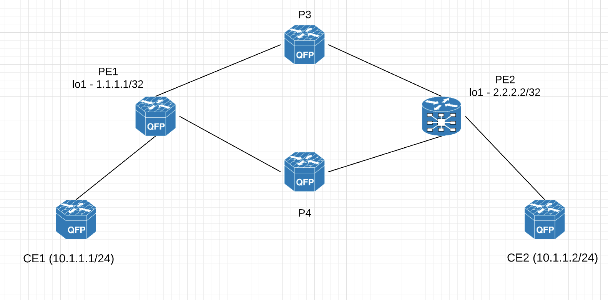

# Basic-MPLS

One of the important use case for using MPLS in Service Provider networks is that the Intermedite/Provider (P) routers need not have the whole IPv4/IPv6 routes in their routing table. Instead, they only need to have labels to reach the remote end PE (Provider Edge) routers. 

To illustrate this, let's assume that we are a service provider (ABC Networks) where our customer needs reachability betwen CE1 and CE2. 



We are running ISIS IGP throughout our network core. 

If we were to use an IP based network only, then P3 and P4 routers will also have to install customer prefix 10.1.1.0/24 and 20.1.1.0/24 in the routing table. Imagine multiple customers connected to our PE routers. This will become difficult to scale our network. 

Let us now introduce MPLS to our network to avoid installing customer prefixes throughout our core network. In Cisco IOS XE, we would need to - 

1. Enable CEF 
2. Define MPLS label protocol as LDP
3. Define Router-ID for LDP (Note that this IP should be reachable from the peer's perspective)
4. Enable MPLS on core network facing interfaces

Let's go through the corresponding commands - 

```
PE1(config)#ip cef distributed 
PE1(config)#mpls label protocol ldp 
PE1(config)#mpls ldp router-id loopback 1
PE1(config)#int range gigabitEthernet 1-2
PE1(config-if-range)#mpls ip
```

That should enable MPLS with LDP to exchange labels for prefixes. Let's verify with the help of a show command - 

```
PE1#show mpls interfaces 
Interface              IP            Tunnel   BGP Static Operational
GigabitEthernet1       Yes (ldp)     No       No  No     Yes        
GigabitEthernet2       Yes (ldp)     No       No  No     Yes        
```

We can apply similar configs on the other XE routers P3 and P4. Note that instead of going to each interface and enabling MPLS manually, we can ask our IGP to enable MPLS (only on those interfaces running the IGP). Let's enable MPLS on P3.

```
P3(config)#ip cef distributed 
P3(config)#mpls label protocol ldp 
P3(config)#mpls ldp router-id loopback 1

P3(config)#router isis test
P3(config-router)#mpls ldp autoconfig 

P3#show mpls interfaces 
Interface              IP            Tunnel   BGP Static Operational
GigabitEthernet1       Yes (ldp)     No       No  No     Yes        
GigabitEthernet2       Yes (ldp)     No       No  No     Yes        
```

The commands are a bit different on IOS XR. 

```
RP/0/0/CPU0:PE2(config)#mpls ldp router-id 4.4.4.4
RP/0/0/CPU0:PE2(config)#mpls ldp 
RP/0/0/CPU0:PE2(config-ldp)#interface gigabitEthernet 0/0/0/0  
RP/0/0/CPU0:PE2(config-ldp-if)#exit                             
RP/0/0/CPU0:PE2(config-ldp)#interface gigabitEthernet 0/0/0/1
RP/0/0/CPU0:PE2(config-ldp-if)#exit 
RP/0/0/CPU0:PE2(config-ldp)#exit

RP/0/0/CPU0:PE2#show mpls interfaces 
Sat Jul 24 16:11:28.303 UTC
Interface                  LDP      Tunnel   Static   Enabled 
-------------------------- -------- -------- -------- --------
GigabitEthernet0/0/0/0     Yes      No       No       Yes
GigabitEthernet0/0/0/1     Yes      No       No       Yes
```

Now that MPLS is enabled on the core, let's check if the LDP neighborships are up. 

```
PE1#show mpls ldp neighbor brief 
Peer LDP id          Uptime     NSR   GR  Discovery    Address    Labels    
-----------          ------     ---   --  ---------    -------    ------    
3.3.3.3:0            00:08:44   N     N   1            3          8         
4.4.4.4:0            00:00:21   N     N   1            3          8         


PE1#show mpls ldp neighbor 
    Peer LDP Ident: 3.3.3.3:0; Local LDP Ident 1.1.1.1:0
        TCP connection: 3.3.3.3.21573 - 1.1.1.1.646
        State: Oper; Msgs sent/rcvd: 22/21; Downstream
        Up time: 00:09:12
        LDP discovery sources:
          GigabitEthernet1, Src IP addr: 13.1.1.3
        Addresses bound to peer LDP Ident:
          13.1.1.3        23.1.1.3        3.3.3.3         
    Peer LDP Ident: 4.4.4.4:0; Local LDP Ident 1.1.1.1:0
        TCP connection: 4.4.4.4.18712 - 1.1.1.1.646
        State: Oper; Msgs sent/rcvd: 12/12; Downstream
        Up time: 00:00:50
        LDP discovery sources:
          GigabitEthernet2, Src IP addr: 14.1.1.4
        Addresses bound to peer LDP Ident:
          14.1.1.4        24.1.1.4        4.4.4.4   
```

On the XR Router

```
RP/0/0/CPU0:PE2#show mpls ldp neighbor  brief 
Sat Jul 24 16:33:23.503 UTC

Peer               GR  NSR  Up Time     Discovery   Addresses     Labels    
                                        ipv4  ipv6  ipv4  ipv6  ipv4   ipv6 
-----------------  --  ---  ----------  ----------  ----------  ------------
4.4.4.4:0          N   N    00:00:45    1     0     3     0     8      0    
3.3.3.3:0          N   N    00:00:27    1     0     3     0     8      0    

RP/0/0/CPU0:PE2#show mpls ldp neighbor        
Sat Jul 24 16:33:26.973 UTC

Peer LDP Identifier: 4.4.4.4:0
  TCP connection: 4.4.4.4:51126 - 2.2.2.2:646
  Graceful Restart: No
  Session Holdtime: 180 sec
  State: Oper; Msgs sent/rcvd: 12/11; Downstream-Unsolicited
  Up time: 00:00:49
  LDP Discovery Sources:
    IPv4: (1)
      GigabitEthernet0/0/0/1
    IPv6: (0)
  Addresses bound to this peer:
    IPv4: (3)
      4.4.4.4        14.1.1.4       24.1.1.4       
    IPv6: (0)

Peer LDP Identifier: 3.3.3.3:0
  TCP connection: 3.3.3.3:46244 - 2.2.2.2:646
  Graceful Restart: No
  Session Holdtime: 180 sec
  State: Oper; Msgs sent/rcvd: 12/11; Downstream-Unsolicited
  Up time: 00:00:31
  LDP Discovery Sources:
    IPv4: (1)
      GigabitEthernet0/0/0/0
    IPv6: (0)
  Addresses bound to this peer:
    IPv4: (3)
      3.3.3.3        13.1.1.3       23.1.1.3       
    IPv6: (0)
```

As we can see, these are TCP sessions to port 646. The source and destination IP for this TCP session would be the loopback 1 IP of the respective routers that were specified in the configuration. 

Ok, the next step is to verify what labels we have received from our LDP neighbors. Let's check this on PE1. 

```
PE1#show mpls ldp bindings 
  lib entry: 1.1.1.1/32, rev 2
        local binding:  label: imp-null
        remote binding: lsr: 3.3.3.3:0, label: 20
        remote binding: lsr: 4.4.4.4:0, label: 16
  lib entry: 2.2.2.2/32, rev 4
        local binding:  label: 16
        remote binding: lsr: 3.3.3.3:0, label: 16
        remote binding: lsr: 4.4.4.4:0, label: 17
  lib entry: 3.3.3.3/32, rev 6
        local binding:  label: 17
        remote binding: lsr: 3.3.3.3:0, label: imp-null
        remote binding: lsr: 4.4.4.4:0, label: 18
  lib entry: 4.4.4.4/32, rev 8
        local binding:  label: 18
        remote binding: lsr: 3.3.3.3:0, label: 17
        remote binding: lsr: 4.4.4.4:0, label: imp-null
  lib entry: 13.1.1.0/24, rev 10
        local binding:  label: imp-null
        remote binding: lsr: 3.3.3.3:0, label: imp-null
        remote binding: lsr: 4.4.4.4:0, label: 19
  lib entry: 14.1.1.0/24, rev 12
        local binding:  label: imp-null
        remote binding: lsr: 3.3.3.3:0, label: 18
        remote binding: lsr: 4.4.4.4:0, label: imp-null
  lib entry: 23.1.1.0/24, rev 14
        local binding:  label: 19
        remote binding: lsr: 3.3.3.3:0, label: imp-null
        remote binding: lsr: 4.4.4.4:0, label: 20
  lib entry: 24.1.1.0/24, rev 16
        local binding:  label: 20
        remote binding: lsr: 3.3.3.3:0, label: 19
        remote binding: lsr: 4.4.4.4:0, label: imp-null
```
There are two bindings for each IPv4 prefixes. PE1 will create a local binding for every prefix and distribute it to its neighbor. So it's neighbors will use this label to send packets to PE1. The remote binding denotes what label PE1 will impose on the packet before sending it out. 

LDP creates bindings for both /32 and non /32 prefixes (which is different from some other vendor implementations like Arista that creates LDP lables only for /32 prefixes). 

There are also two remote bindings for prefix (f.ex. 2.2.2.2/32 which is the loopback of PE2). So how will LDP choose which remote label to choose and send traffic? The answer is - it depends on where the IGP points to. 

In this case, IGP points to 13.1.1.3 which is towards P3
```
PE1#show ip route 2.2.2.2 longer-prefixes 

      2.0.0.0/32 is subnetted, 1 subnets
i L1     2.2.2.2 [115/30] via 13.1.1.3, 00:00:15, GigabitEthernet1
```

Therefore, packets are sent towards P3 with a label of 16. 

```
PE1#show ip cef 2.2.2.2 
2.2.2.2/32
  nexthop 13.1.1.3 GigabitEthernet1 label 16-(local:16)


PE1#traceroute 2.2.2.2
Type escape sequence to abort.
Tracing the route to 2.2.2.2
VRF info: (vrf in name/id, vrf out name/id)
  1 13.1.1.3 [MPLS: Label 16 Exp 0] 2 msec 2 msec 1 msec
  2 23.1.1.2 9 msec 2 msec * 
  ```
We can see that even to reach the non /32 subnet 24.1.1.0, we will impose label on the packet
```
PE1#show ip cef 24.1.1.2
24.1.1.0/24
  nexthop 13.1.1.3 GigabitEthernet1 label 19-(local:20)
```

Another useful command is to check the MPLS forwarding table
```
PE1#show mpls forwarding-table 
Local      Outgoing   Prefix           Bytes Label   Outgoing   Next Hop    
Label      Label      or Tunnel Id     Switched      interface              
16         16         2.2.2.2/32       0             Gi1        13.1.1.3    
17         Pop Label  3.3.3.3/32       0             Gi1        13.1.1.3    
18         17         4.4.4.4/32       0             Gi1        13.1.1.3    
19         Pop Label  23.1.1.0/24      0             Gi1        13.1.1.3    
20         19         24.1.1.0/24      0             Gi1        13.1.1.3  
```
Now back to our original requirement of CE1 to ping CE2; we have added a static route on both the PE routers (note this can be done dynamically with the help of L3VPN but we are not going there yet)

```
PE1#show ip route 20.1.1.2 longer-prefixes 
      20.0.0.0/32 is subnetted, 1 subnets
S        20.1.1.2 [1/0] via 2.2.2.2
```
Note that P3 does not have route to 20.1.1.2 and that is fine. Because the forwarding is based on only MPLS labels. When PE1 sends the packet with a label of 16, P3 is going to pop that label and send it to 23.1.1.2 (to PE2) as per the MPLS table. 

```
P3#show ip route 20.1.1.2
% Network not in table
```


```
P3#show mpls forwarding-table 
Local      Outgoing   Prefix           Bytes Label   Outgoing   Next Hop    
Label      Label      or Tunnel Id     Switched      interface              
16         Pop Label  2.2.2.2/32       1298          Gi2        23.1.1.2    
```

The end to end ping works using our MPLS labelled path. 
```
CE1#ping 20.1.1.2 source lo1
Type escape sequence to abort.
Sending 5, 100-byte ICMP Echos to 20.1.1.2, timeout is 2 seconds:
Packet sent with a source address of 10.1.1.1 
!!!!!
Success rate is 100 percent (5/5), round-trip min/avg/max = 3/11/40 ms
```


