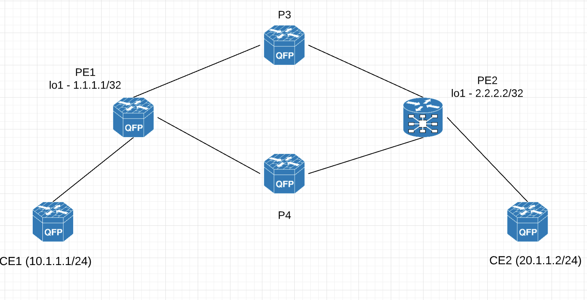

# Basic-MPLS

One of the important use case for using MPLS in Service Provider networks is that the Intermedite/Provider (P) routers need not have the whole IPv4/IPv6 routes in their routing table. Instead, they only need to have labels to reach the remote end PE (Provider Edge) routers. 

To illustrate this, consider the below topology owned by a service provider (ABC Networks). 

